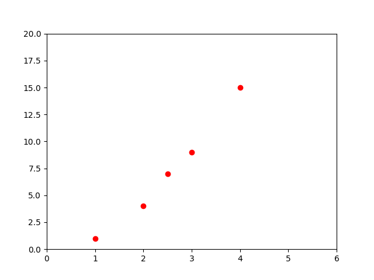

## Algorithmes d'apprentissage fondamentaux
Dans cette note, nous allons parcourir 4 algorithmes fondamentaux d'apprentissage automatique. Nous appliquerons chacun de ces algorithmes à des problèmes et des ensembles de données uniques avant de mettre en évidence les cas d'utilisation de chacun.<br/>

Les algorithmes sur lesquels nous allons nous concentrer sont les suivants:
- Régression linéaire;
- Classification;
- Clusturing;
- Hidden Markov Models;

Il existe de nombreux outils au sein de TensorFlow qui pourraient être utilisés pour résoudre les problèmes que nous allons voir ci-dessous. J'ai choisi les outils qui, selon moi, offrent le plus de variété et sont les plus faciles à utiliser.

### Régression linéaire
La régression linéaire est l'une des formes les plus fondamentales de l'apprentissage automatique et est utilisée pour prédire des valeurs numériques. Dans ce cours, nous allons utiliser un modèle linéaire pour prédire le taux de survie des passagers à partir de l'ensemble de données du Titanic.

#### Comment ça marche ?
Avant de nous plonger dans le vif du sujet, je vais te donner une explication très superficielle de l'algorithme de régression linéaire.<br/>

La régression linéaire suit un concept très simple. Si les points de données sont liés de façon linéaire, alors nous pouvons générer une ligne (droite) de meilleur ajustement pour ces points et l'utiliser pour prédire les futures valeurs.<br/>

Prenons l'exemple d'un ensemble de données (dataset) avec une caractéristique (variable) et une étiquette (sortie). C'est à dire **y = f(x)**.

```python
import numpy as np
import matplotlib.pyplot as plt

# On génère un ensemble de points sous la forme y = f(x).
X = [1, 2, 2.5, 3, 4]
Y = [1, 4, 7, 9, 15]

# On affiche une représentation graphique:
plt.plot(X, Y, 'ro')
plt.axis([0, 6, 0, 20])
plt.show()

```




$$ (E=mc^2)，x_{1,2} = \frac{-b \sqrt{b^2-4ac}}{2b}. $$

<br/>
<br/>

[<--](../README.md) Je reviens à la session **précédente**: [TensorFlow](../README.md)

<script id="MathJax-script" async src="https://cdn.jsdelivr.net/npm/mathjax@3/es5/tex-mml-chtml.js"></script>

