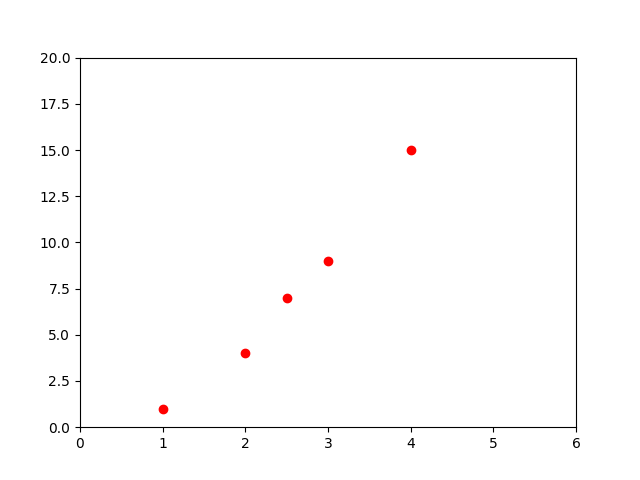
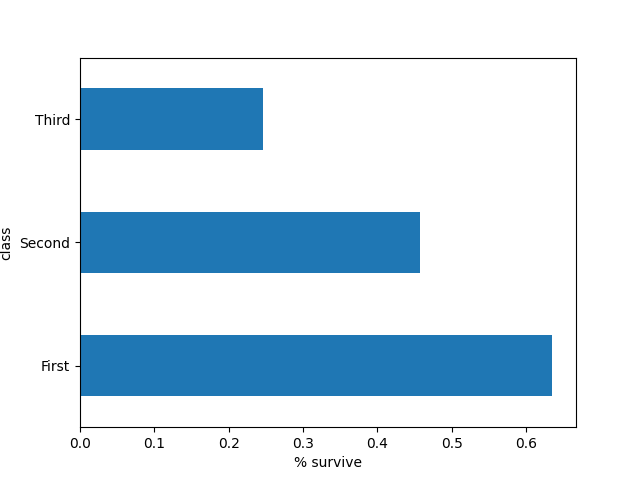
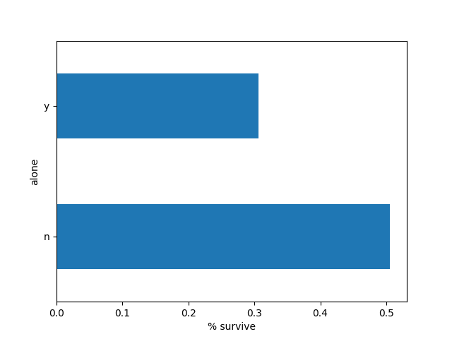

## Algorithmes d'apprentissage fondamentaux


Ces algorithmes ne sont pas spécifiques à TensorFlow, mais on va les mettres en œuvre avec les outils de TensorFlow. Avant de passer à des choses comme les réseaux neuronaux et des techniques d'apprentissage automatique plus avancées, tu dois vraiment comprendre comment ils fonctionnent parce qu'ils sont utilisés dans beaucoup de techniques différentes et combinés ensemble. et l'un d'entre eux est en fait très puissant si vous l'utilisez de la bonne façon. Une grande partie des implémentations des algorithmes d'apprentissage automatique, utilisent en fait des modèles assez basiques. Parce que ces modèles sont capables de faire des choses très puissantes. Ne t'inquiette pas, on a pas affaire à quelque chose de follement compliqué.<br/>

Ils s'agit donc quatre (04) algorithmes fondamentaux de machine learning. Nous appliquerons chacun de ces algorithmes à des problèmes et des ensembles de données (dataset) uniques afin de mettre en évidence leurs cas d'utilisation.

Ces 04 algorithmes sont les suivants:
- Régression linéaire;
- Classification;
- Clusturing;
- Hidden Markov Models.

Il existe de nombreux outils au sein de TensorFlow qui pourraient être utilisés pour résoudre les problèmes que nous allons voir ci-dessous. J'ai choisi les outils qui, selon moi, offrent le plus de variété et sont les plus faciles à utiliser.

<details id="table-content" open>
    <summary>Table des Contenus</summary>
    <ul>
        <li><a href="#régression-linéaire">Régression linéaire</a>
            <ul>
                <li><a href="#comment-ça-marche">Comment ça marche ?</a></li>
                <li><a href="#importation-des-modules">Importation des modules</a></li>
                <li><a href="#travailler-avec-les-données">Travailler avec les données</a>
                    <ul>
                        <li><a href="#récupération-des-données">Récupération des données</a></li>
                        <li><a href="#exploration-des-données">Exploration des données</a></li>
                        <li><a href="#Différence-entre-données-d-entrainement-et-données-de-teste">Différence entre données d'entrainement et données de teste</a></li>
                        <li><a href="#colonnes-des-caractéristiques">Colonnes des caractéristiques</a></li>
                    </ul>
                </li>
            </ul>
        </li>
        <li><a href="#classification">Classification</a>
            <ul>
                <li><a href="#importation-des-modules">Importation des modules</a></li>
                <li><a href="#chargement-de-la-dataset"> Chargement de la dataset</a></li>
                <li><a href="#fonction-de-construction-du-dataset">Fonction de construction du dataset</a></li>
            </ul>
        </li>
    </ul>

</details>
<br/>

### Régression linéaire
La régression linéaire est l'une des formes les plus fondamentales de l'apprentissage automatique et est utilisée pour prédire des valeurs numériques. Dans ce cours, nous allons utiliser un modèle linéaire pour prédire le taux de survie des passagers à partir de l'ensemble de données du Titanic.

#### Comment ça marche?
Avant de nous plonger dans le vif du sujet, je vais te donner une explication très superficielle de l'algorithme de régression linéaire.<br/>

La régression linéaire suit un concept très simple. Si les points de données sont liés de façon linéaire, alors nous pouvons générer une ligne (droite) de meilleur ajustement pour ces points et l'utiliser pour prédire les futures valeurs.<br/>

Prenons l'exemple d'un ensemble de données (dataset) avec une caractéristique (variable) et une étiquette (sortie). C'est à dire $y = f(x)$.

```python
import numpy as np
import matplotlib.pyplot as plt

# On génère un ensemble de points sous la forme y = f(x).
X = [1, 2, 2.5, 3, 4]
Y = [1, 4, 7, 9, 15]

# On affiche une représentation graphique:
plt.plot(X, Y, 'ro')
plt.axis([0, 6, 0, 20])
plt.show()

```



Nous pouvons voir que ces données ont une tendance linéaire. Lorsque la valeur `x` augmente, la valeur `y` augmente également. Grâce à cette variation, nous pouvons établir une **ligne (droite)** de meilleur ajustement pour cet ensemble de données. Dans cet exemple, notre droite n'utilisera qu'une seule variable d'entrée, car nous travaillons dans le plan. Dans un ensemble de données plus grand avec plus de caractéristiques, notre droite aura plus de variables.

>"La droite de meilleur ajustement fait référence à une droite qui traverse un nuage de points de données et exprime une meilleur relation entre ces points."
> [Vas sur ce lien.](https://www.investopedia.com/terms/l/line-of-best-fit.asp)

Voici un rappel de l'équation d'une droite dans le plan.

$$ y = ax + b $$

Voici un exemple de droite de meilleur ajustement pour le graphe ci-dessus.

```python
plt.plot(X, Y, 'ro')
plt.axis([0, 6, 0, 20])

un_x = np.unique(X)
poly1d = np.poly1d(np.polyfit(X, Y, 1))

plt.plot(un_x, poly1d(un_x))
plt.show()

```


Une fois que nous avons généré cette ligne pour notre ensemble de données, nous pouvons utiliser son équation pour prédire les futures valeurs, c'est à dire: les valeurs qui ne sont pas dans l'ensemble de données (dataset).

#### Importation des modules
La ligne suivante n'est pas requise sauf si tu travail dans un `notebook`.

```python
%tensorflow_version 2.x
```

```python
# Importation des modules.
from __future__ import absolute_import, division, print_function, unicode_literals

import numpy as np
import pandas as pd
import matplotlib.pyplot as plt
from IPython.display import clear_output
from six.moves import urllib

# tensorflow
import tensorflow.compat.v2.feature_column as fc
import tensorflow as tf

```

#### Travailler avec les données
Le jeu de données (dataset) sur lequel nous allons travailler est celui du Titanic. Il contient des tonnes d'informations sur chaque passager du navire. Notre première étape sera d'explorer les données afin de les comprendre. C'est donc ce que nous allons faire ! <br/>

Il s'agit donc essentiellement de prédire qui va survivre, ou la probabilité que quelqu'un survive au Titanic, à partir d'un ensemble d'informations. On a donc besoin de charger cet ensemble de données.<br/>

Ci-dessous, nous allons charger le jeu de données et apprendre comment l'explorer à l'aide de certains outils intégrés.<br/>

##### Récupération des données
La fonction `pd.read_csv()` nous renvoie un nouvelle instance de `DataFrame` de pandas. Vous pouvez considérer un *dataframe* comme un tableau. C'est donc avec cette fonction qu'on charger notre ensemble de donnée encore appeler **dataset** en Anglais. <br/>

Avec la fonction `pop()`, on va extraire la colonne `"survived"` de notre dataset pour la stocker dans une nouvelle variable (`y_train` et `y_eval`). Cette colonne nous indique simplement si la personne a survécu ou non.<br/>

```python
# On va utiliser pandas  pour charger les données
# qui sont disponibles au format CSV (Comma Separated Values).
# On va charger les données pour l'entrainement du modèle:
df_train = pd.read_csv("https://storage.googleapis.com/tf-datasets/titanic/train.csv")

# On va charger les données pour l'évaluation du modèle:
df_eval = pd.read_csv("https://storage.googleapis.com/tf-datasets/titanic/eval.csv")

# Après le chargement, on affiche juste les données
# qu'on va utiliser pour l'entraînement.
print(df_train)

y_train = df_train.pop("survived")
y_eval = df_eval.pop("survived")

# Note:
# les raisons pour lesquelles la dataset a été séparée en deux
# est l'évaluation et le calcule de pourcentage de précision
# du modèle après entrainement.
```

Ce code produit le résultat ci-dessous:

```
     survived     sex   age  n_siblings_spouses  parch     fare   class     deck  embark_town alone
0           0    male  22.0                   1      0   7.2500   Third  unknown  Southampton     n
1           1  female  38.0                   1      0  71.2833   First        C    Cherbourg     n
2           1  female  26.0                   0      0   7.9250   Third  unknown  Southampton     y
3           1  female  35.0                   1      0  53.1000   First        C  Southampton     n
4           0    male  28.0                   0      0   8.4583   Third  unknown   Queenstown     y
..        ...     ...   ...                 ...    ...      ...     ...      ...          ...   ...
622         0    male  28.0                   0      0  10.5000  Second  unknown  Southampton     y
623         0    male  25.0                   0      0   7.0500   Third  unknown  Southampton     y
624         1  female  19.0                   0      0  30.0000   First        B  Southampton     y
625         0  female  28.0                   1      2  23.4500   Third  unknown  Southampton     n
626         0    male  32.0                   0      0   7.7500   Third  unknown   Queenstown     y

[627 rows x 10 columns]
```

Et voici à quoi ressemble notre ensemble de données ! Je sais que cela semble être un tas de charabia, 
mais c'est comme ça que nous devons le charger.<br/>

##### Exploration des données
Pour commencer, on va afficher les dimensions de notre dataset, c'est à dire, afficher les nombres de lignes et de colonnes.

```python
sh = df_train.shape
print(sh)  # Ce qui affiche: (627, 9)

```

Donc, on a 627 éléments ou lignes et 9 caractéristiques (variables) ou colonnes observées sur chacun de ces éléments. <br/>

Nous avons donc nos colonnes, qui représentent simplement les différents attributs ou variables dans notre ensemble de données.
Et de ces différents attributs de notre ensemble de données, nous avons la colonne `"survived"`. Ce sont les valeur de cette dernière
qu'on va essayer de prédire avec notre modèle. On va donc appeller cette colonne **notre étiquette**. Ainsi, ici, `0` signifie
que la personne n'a pas survécu, et `1` signifie que la personne a survécu.<br/> 

Concernant la colonne des informations sur les survivants qui avait été extraite,
elle est belle et bien stockée dans la variable `y_train`.

```python
print(y_train.head())

```

```
0    0
1    1
2    1
3    1
4    0
Name: survived, dtype: int64
```

Pour afficher les données, on peut utiliser la méthode `head()` de l'instance `DataFrame`. Elle permet tout simplement 
d'afficher les 5 premiers éléments en tête de liste de notre dataframe.

```python
head = df_train.head()
print(head)

```

```
      sex   age  n_siblings_spouses  parch     fare  class     deck  embark_town alone
0    male  22.0                   1      0   7.2500  Third  unknown  Southampton     n
1  female  38.0                   1      0  71.2833  First        C    Cherbourg     n
2  female  26.0                   0      0   7.9250  Third  unknown  Southampton     y
3  female  35.0                   1      0  53.1000  First        C  Southampton     n
4    male  28.0                   0      0   8.4583  Third  unknown   Queenstown     y
```

Si nous voulons une analyse statistique de nos données, nous pouvons utiliser la méthode `describe()`.

```python
desc = df_train.describe()
print(desc)

```

```
              age  n_siblings_spouses       parch        fare
count  627.000000          627.000000  627.000000  627.000000
mean    29.631308            0.545455    0.379585   34.385399
std     12.511818            1.151090    0.792999   54.597730
min      0.750000            0.000000    0.000000    0.000000
25%     23.000000            0.000000    0.000000    7.895800
50%     28.000000            0.000000    0.000000   15.045800
75%     35.000000            1.000000    0.000000   31.387500
max     80.000000            8.000000    5.000000  512.329200
```

Maintenant, en y réfléchissant seul pendant une seconde, et en regardant certaines des catégories que nous avons ici, peux tu penser à la raison pour laquelle la régression linéaire serait un bon algorithme pour quelque chose comme ça ? Eh bien, analysons un peut notre
ensemble de données.

- Si le passager est une femme, on peut supposer qu'elle aura plus de chances de survivre, juste parce que, tu le sais, la façon dont notre culture fonctionne, les femmes et les enfants sont sauvés d'abord, on est d'accord ? Et si tu regarde bien cet ensemble de données, tu remarquera que lorsqu'il s'agit d'une femme, il est assez rare qu'elle n'ait pas survécue. D'ailleurs, essayons d'afficher le graphe du pourcentage des survivants en fonction du sexe.


```python
# On reconstitue la dataset avec la colonne "survived"
# pour qu'on puisse compter.
ds_with_survived_column = [df_train, y_train]
pd.concat(ds_with_survived_column, axis=1).groupby('sex')\
        .survived.mean()\
        .plot(kind='barh')\
        .set_xlabel('% survive')

plt.show()

```


- Maintenant, si nous regardons l'âge.

```python
df_train.age.hist(bins=20)
plt.show()

```


Peut on penser comment l'âge pourrait avoir d'inffluance sur les résultats ? Eh bien, je suppose que si le passager est beaucoup plus jeune, alors il a probablement plus de chances de survivre, parce qu'il serait, comme tu le sais déjà, prioritaire pour être secouru par un canots de sauvetage ou quoi que ce soit, je ne sais pas grand-chose. Je ne peux donc tirer aucune conclusion à ce sujet.
J'essaie juste de passer en revue les attributs pour t'expliquer pourquoi nous devons choisir l'algorithme de la régression linéaire.

- Le nombre de frères et sœurs (`n_siblings_spouses`) n'influe pas forcément sur la prédiction, à mon avis.
- Donc la colone `"class"` porte les informnations sur la classe de chaque passager dans le bateau. Il y avait trois (3), première classe, 
deuxième classe et troisième classe.

```python
pd.concat(ds_with_survived_column, axis=1).groupby('class')\
        .survived.mean()\
        .plot(kind='barh')\
        .set_xlabel('% survive')

plt.show()

```



En exploitant le graphe ci-dessus, On pourrait donc penser qu'un passager qui fait partie d'une classe supérieure a plus de chances de survivre.

- Concernant la colonne `"alone"`, reprenons le code de représentation graphique ci-dessus et remplace tout simplement 
`'class'` par `'alone'` et exécute le code ensuite. Moi, lorsque j'exécute, j'ai le graphe ci-dessous:



Après analyse, on constate que c'est ceux qui ont voyagés seul qui ont eu plus de change.<br/>


```python
# Pour représenter les effectifs totaux au niveau des deux sexes.
df_train.sex.value_counts().plot(kind='barh')
plt.show()

```


```python
# Pour représenter les effectifs totaux au niveau des trois classes.
df_train['class'].value_counts().plot(kind='barh')
plt.show()

```


Après avoir analysé toutes ces informations, on note ce qui suit:
- La majorité des passagers ont entre 20 et 30 ans.
- La majorité des passagers sont des hommes.
- La majorité des passagers sont en "troisième" classe.
- La majorité des passagers qui ont survécues sont des femme.
- La majorité des passagers qui ont survécues on voyagé seul.
- La majorité des passagers qui ont survécues font partie de la première classe (classe supérieur).

##### Différence entre données d'entrainement et données de teste
Tu as remarqué que nous avons chargé deux ensembles de données différents ci-dessus. En effet, lorsque nous voulons entraîner des modèles, nous avons besoin de deux ensembles de données : l'ensemble des données d'**entraînement** et celui de **teste**.

Les données d'entraînement sont celles qu'on transmet au modèle pour qu'il puisse se développer et apprendre. Elles sont généralement beaucoup plus volumineuses que les données de test.

Les données de test sont celles qu'on utilise pour évaluer le modèle et voir s'il fonctionne bien. Il faut toujours utiliser un ensemble de données sur lequel le modèle n'a pas été entraîné pour l'évaluer.

> Explique moi pourquoi ?

L'objectif est de pouvoir faire des prédictions sur de **NOUVELLES** données avec notre modèle, des données que nous n'avons jamais vues auparavant. Si on teste simplement le modèle sur les données qu'il a déjà vues, on ne pourra pas mesurer sa précision avec exactitude. On ne peut pas être sûrs qu'il n'a pas simplement mémorisé nos données d'apprentissage. C'est pourquoi on sépare nos données de test et d'apprentissage.


##### Colonnes des caractéristiques

```
     survived     sex   age  n_siblings_spouses  parch     fare   class     deck  embark_town alone
0           0    male  22.0                   1      0   7.2500   Third  unknown  Southampton     n
1           1  female  38.0                   1      0  71.2833   First        C    Cherbourg     n
2           1  female  26.0                   0      0   7.9250   Third  unknown  Southampton     y
3           1  female  35.0                   1      0  53.1000   First        C  Southampton     n
4           0    male  28.0                   0      0   8.4583   Third  unknown   Queenstown     y
```

On peut voir qu'une donnée catégorisée n'est pas une donnée numérique. Par exemple, le sexe d'un passager, le fait que passager est survécu ou pas, la classe dans laquelle le passager appartient, sont des données catégorielles. Ce sont donc des données dont les valeurs ne sont pas incrémentable. Alors les données numériques prennent des valeurs incrémentables, par exemple l'âge d'un passager, le prix (la colonne `"fare"`).
<!--Obtenir des données catégorisées est assez courante. -->
Les données catégorielles sont à **valeur qualitative** et les données numériques sont à **valeur quantitative**.

De notre dataset, on peut énumérer des données catégorielles et des données numériques, dans le tableau ci-dessous.

| Donnée catégorielles (à valeurs qualitatives) | Données numériques (à valeurs quantitatives)|
|-----------------------------------------------|---------------------------------------------|
| `"survived"`, `"sex"`, `"n_siblings_spouses"`, `"parch"`, `"class"` , `"deck"`, `"embark_town"`, `"alone"` | `"age"`, `"fare"`|

> Maintenant, qu'est ce qu'on va faire avec les données catégorielles ?

On sait au moins, d'une manière ou d'une autre, que nous devons transformer ces données en nombre. Le plus souvent, on transforme les données catégorielles en **nombre entier**. On peut par exemple représenter les données sur le sexe des passagers par des 0 et des 1; le sexe masculin (`male`) sera représenté par `0` et le sex féminin (`female`) sera représenté par `1`.

> Mais, pourquoi transformer ces données en nombre ? Elles seront moins lisibles et significatives que si tu les laisses comme t-elle.

Oui je te comprend. En réalité, le modèle qu'on veut entraîner est comme une équation ou formule mathématique. Et comme tu le sais, et que tu l'as toujours su, une formule mathématique nous permet de faire des calculs. Et qui dit, faire des calculs, veut dire faire des additions, soustrations, multiplications, etc avec des nombres et NON des noms. Notre modèle étant une formule mathématique, il doit donc prendre des nombres en entré pour effectuer un calcul et ensuite nous donner des nombres en sortie. En gros, on ne manipule que des nombres. C'est pour cela qu'il faut convertir `male` et `female` qui ne sont rien que des noms de catégorie ou classe, en nombres entiers qui représenterons chacun d'entre eux.

> Pourquoi des nombres entiers ? Pourquoi on ne choisirait pas des nombres réels ?

Très bonne question. Au fait, les données catégorielles sont des données qui prennent des valeurs discrettes et finies. C'est à dire qu'on peut compter le nombre de valeurs prises par une donnée catégorielle. Or, les nombres réels sont continus et infinis. Ce qui n'est pas le cas pour les nombres entiers. D'où, on préfère représenter les données catégorielles par des nombres entiers.

Ainsi, on a:
- pour la colonne `"sex"`: **`0`** => `male` et **`1`** => `female`.
- pour la colonne `"class"`: **`0`** => `First`, **`1`** => `Second` et **`2`** => `Third`.

Donc, on doit pouvoir encoder ces types de données ainsi avant de passer à l'étape suivante. Mais, plus besoin de le faire manuellement,
car TensorFlow peut maintenant le faire pour nous dans sa version 2.0 en utilisant les fonctions `categorical_column_with_vocabulary_list()` sur les colonnes de données catégorielles et `numeric_column()` sur les colonnes de données numériques.

Ecrivons donc le code qui va nous permetre de réaliser cette opération.

```python
# Notre modèle linéaire doit avoir toutes les différentes
# colonnes que nous allons utiliser, il doit donc connaître
# toutes les entrées différentes qui peuvent se trouver 
# dans chacune de ces colonnes. Il doit également
# savoir s'il s'agit d'une colonne catégorielle ou numérique.

#:obj:`list` of :obj:`str`: Liste des noms de colonnes à valeur quantitative
NUMERIC_COLUMNS = ['age', 'fare']

#:obj:`list` of :obj:`str`: Liste des noms de colonnes à valeur qualitative
CATEGORICAL_COLUMNS = ['sex',
                       'n_siblings_spouses',
                       'parch',
                       'class',
                       'deck',
                       'embark_town',
                       'alone']

feature_columns = []  # Liste des colonnes

# Pour chaque nom de colonne qu'on prend dans la 
# liste des colonnes à valeur qualitative
for column_name in CATEGORICAL_COLUMNS:
    # On récupère les valeurs uniques qu'on considère 
    # comme vocabulaire.
    vocab = df_train[column_name].unique()

    # Cela va créer une colonne, sous la forme d'un tableau Numpy, 
    # qui contient le nom de la caractéristique, et tout le vocabulaire
    # qui lui est associé.
    categorical_column = tf.feature_column\
            .categorical_column_with_vocabulary_list(column_name, vocab)

    feature_columns.append(categorical_column)

# Pour chaque nom de colonne qu'on prend dans la 
# liste des colonnes à valeur quantitative
for column_name in NUMERIC_COLUMNS:
    numerical_column = tf.feature_column.numeric_column(column_name,
                                                        dtype=tf.float32)
    feature_columns.append(numerical_column)

# on affiche le contenu de notre liste `feature_columns`.
print(feature_columns)

```

Ce qui produit le résultat suivant:

```
[VocabularyListCategoricalColumn(key='sex', vocabulary_list=('male', 'female'), dtype=tf.string, default_value=-1, num_oov_buckets=0), VocabularyListCategoricalColumn(key='n_siblings_spouses', vocabulary_list=(1, 0, 3, 4, 2, 5, 8), dtype=tf.int64, default_value=-1, num_oov_buckets=0), VocabularyListCategoricalColumn(key='parch', vocabulary_list=(0, 1, 2, 5, 3, 4), dtype=tf.int64, default_value=-1, num_oov_buckets=0), VocabularyListCategoricalColumn(key='class', vocabulary_list=('Third', 'First', 'Second'), dtype=tf.string, default_value=-1, num_oov_buckets=0), VocabularyListCategoricalColumn(key='deck', vocabulary_list=('unknown', 'C', 'G', 'A', 'B', 'D', 'F', 'E'), dtype=tf.string, default_value=-1, num_oov_buckets=0), VocabularyListCategoricalColumn(key='embark_town', vocabulary_list=('Southampton', 'Cherbourg', 'Queenstown', 'unknown'), dtype=tf.string, default_value=-1, num_oov_buckets=0), VocabularyListCategoricalColumn(key='alone', vocabulary_list=('n', 'y'), dtype=tf.string, default_value=-1, num_oov_buckets=0), NumericColumn(key='age', shape=(1,), default_value=None, dtype=tf.float32, normalizer_fn=None), NumericColumn(key='fare', shape=(1,), default_value=None, dtype=tf.float32, normalizer_fn=None)]
```


### Classification
Essentiellement, la classification consiste à différencier les points de données et à les séparer en classes. Plutôt que de prédire une valeur numérique, comme cela se fait avec la régression linéaire, on prédit des classes. Donc, il s'agira en réalité de prédire la probabilité qu'un point spécifique de l'ensemble de données appartienne à chacune de toutes les classes.<br/>

Pour illustrer un peu le concept, nous allons construire un modèle de classification sur l'ensemble des données des fleurs d'iris. Nous allons utiliser différentes propriétés des fleurs pour prédire de quelle espèce de fleur il s'agit.

#### Importation des modules
La ligne suivante n'est pas requise sauf si tu travail dans un `notebook`.

```python
%tensorflow_version 2.x
```

Ensuite, on importe toute l'artillerie qu'il faut dans le code suivant.

```python
# Importation des modules.
from __future__ import absolute_import, division, print_function, unicode_literals

import pandas as pd
import tensorflow as tf

```

#### Chargement de la dataset
Comme je le disais, l'ensemble de données que nous allons utilisé est celui des fleurs d'Iris. Cette dataset comporte trois (03) catégories de fleures. Ces catégories sont *Setosa*, *Versicolor* et *Viginica*. Ne fais pas attention. Les informations que nous disposons pour chaque fleure sont les suivantes:
- longueur des sépales;
- largeur du sépale;
- longueur des pétales;
- largeur des pétales.

Ces informations caractérisent chaque fleure de l'ensemble de données. On va donc définir quelques constantes qui vont nous servir dans le code.

```python
COLUMN_NAMES = ['sepal_length', 'sepal_width', 'petal_length', 'petal_width', 'species']  # `species` pour dire `espèce`.

# Les catégories représentent ici les espèces de fleures.
SPECIES = ['Setosa', 'Versicolor', 'Viginica']

```

On peut donc écrire le code qui va nous permettre de charger l'ensemble de données.

```python
train_path = tf.keras.utils.get_file(
    "iris_training.csv",
    
    ("https://storage.googleapis.com/"
    "download.tensorflow.org/data/iris_training.csv")
    
    )
test_path = tf.keras.utils.get_file(
    "iris_test.csv",
    ("https://storage.googleapis.com/"
    "download.tensorflow.org/data/iris_test.csv")
    
    )

# Je vais utiliser les noms que j'ai mis dans la constante COCOLUMN_NAMES
# comme nom de colonne pour les dataframes.
dftrain = pd.read_csv(train_path, names=COLUMN_NAMES, header=0)
dftest = pd.read_csv(test_path, names=COLUMN_NAMES, header=0)

# header=0 signifie qu'on veut que la ligne d'indice 0 du tableau
# soit considérée comme l'entête.

# on affiche
print(dftrain)
print(dftrain.shape)
```

```
Downloading data from https://storage.googleapis.com/download.tensorflow.org/data/iris_training.csv
2194/2194 [==============================] - 0s 0us/step
Downloading data from https://storage.googleapis.com/download.tensorflow.org/data/iris_test.csv
573/573 [==============================] - 0s 0us/step
     sepal_length  sepal_width  petal_length  petal_width  species
0             6.4          2.8           5.6          2.2        2
1             5.0          2.3           3.3          1.0        1
2             4.9          2.5           4.5          1.7        2
3             4.9          3.1           1.5          0.1        0
4             5.7          3.8           1.7          0.3        0
..            ...          ...           ...          ...      ...
115           5.5          2.6           4.4          1.2        1
116           5.7          3.0           4.2          1.2        1
117           4.4          2.9           1.4          0.2        0
118           4.8          3.0           1.4          0.1        0
119           5.5          2.4           3.7          1.0        1

[120 rows x 5 columns]
(120, 5)
```

Maintenant, on va extraire la colones `"species"` qui sera utilisée comme étiquette (sortie du modèle).

```python
y_train = dftrain.pop('species')
y_test = dftest.pop('species')

print(dftrain.head())  # La colonne "species" est maintenant extraite.
print(dftrain.shape)  # Maintenant, on aura 120 lignes et 4 colonnes (variables).
```

```
   sepal_length  sepal_width  petal_length  petal_width
0           6.4          2.8           5.6          2.2
1           5.0          2.3           3.3          1.0
2           4.9          2.5           4.5          1.7
3           4.9          3.1           1.5          0.1
4           5.7          3.8           1.7          0.3
(120, 4)
```

```python
print(y_train.head())
```

```
0    2
1    1
2    2
3    0
4    0
Name: species, dtype: int64
```

La colonne `"species"` est donc belle et bien stockée dans la variable `y_train`.


#### Fonction de construction du dataset

```python
def get_dataset(features, labels, training=True, batch_size=256):
    """Fonction de construction de dataset.

    Cette fonction permet de convertir l'ensemble de données
    contenu dans le dataframe en dataset pour l'entrainement du modèle.

    Args:
        features (:obj:`pd.DataFrame`): Les données comportant
            les variables d'entrée.
        labels (:obj:`pd.DataFrame`): Les donnée de sortie qui constituent
            les étiquettes
        training (bool): Indique si ce sont des données d'entrainement ou pas.
        batch_size (int): Le nombre d'éléments de données qu'on veut avoir par lot.

    Returns:
        BatchDataset: Retourne la dataset comportant des lots de données.
    """
    dataset = tf.data.Dataset.from_tensor_slices((dict(features), labels))

    # Mélange et crée des répétition, s'il la dataset qui sera retournée
    # sera utilisée pour l'entrainement.
    if training:
        dataset = dataset.shuffle(1000).repeat()

    # On sépare le tout par lot de `batch_size` avant de retourner
    # le résultat.
    dataset = dataset.batch(batch_size)
    return dataset

```

#### Colonne des caractéristiques

```python
feature_columns = []
for colname in dftrain.keys():
    nc = tf.feature_column.numeric_column(key=colname)
    feature_columns.append(nc)

print(feature_columns)

```

```
[NumericColumn(key='sepal_length', shape=(1,), default_value=None, dtype=tf.float32, normalizer_fn=None), NumericColumn(key='sepal_width', shape=(1,), default_value=None, dtype=tf.float32, normalizer_fn=None), NumericColumn(key='petal_length', shape=(1,), default_value=None, dtype=tf.float32, normalizer_fn=None), NumericColumn(key='petal_width', shape=(1,), default_value=None, dtype=tf.float32, normalizer_fn=None)]
```

Nous n'avons donc plus besoin de faire un vocabulaire avec la fonction `.unique()`
car, encore une fois, tout cela est déjà codé pour nous.

<br/>
<br/>

- Je passe à la session **suivante**: [Deep Learning](../deep_learning/README.md)
- [<--](../installation/README.md) Je reviens à la session **précédente**: [Installation et configuration](../installation/README.md)

