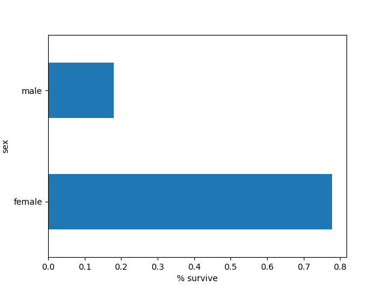
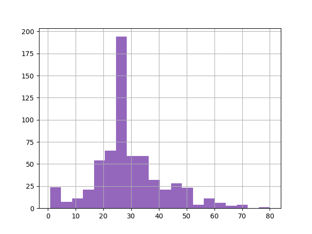
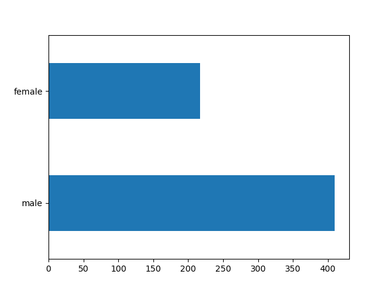
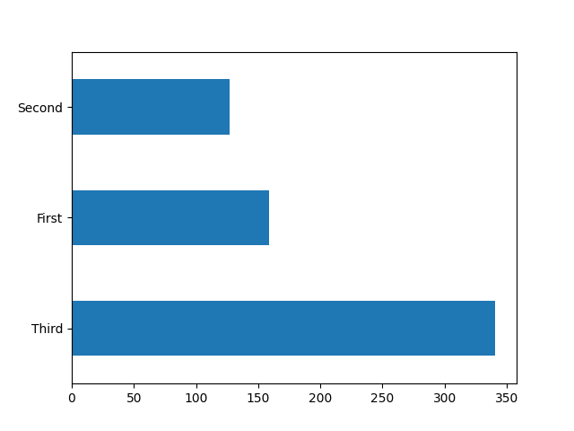
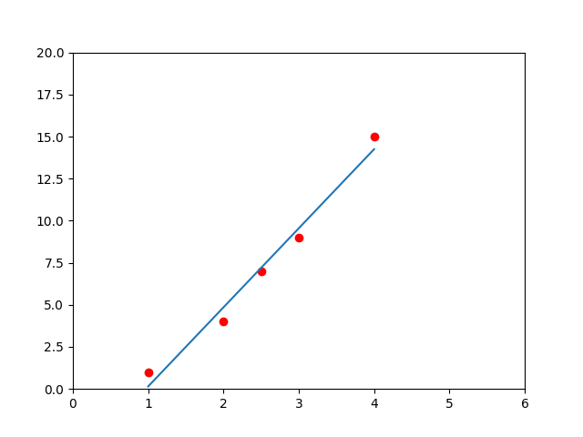

## Algorithmes d'apprentissage fondamentaux
Dans cette note de cour, nous allons parcourir 4 algorithmes fondamentaux d'apprentissage automatique. Nous appliquerons chacun de ces algorithmes à des problèmes et des ensembles de données uniques avant de mettre en évidence les cas d'utilisation de chacun.<br/>

Les algorithmes sur lesquels nous allons nous concentrer sont les suivants:
- Régression linéaire;
- Classification;
- Clusturing;
- Hidden Markov Models;

Il existe de nombreux outils au sein de TensorFlow qui pourraient être utilisés pour résoudre les problèmes que nous allons voir ci-dessous. J'ai choisi les outils qui, selon moi, offrent le plus de variété et sont les plus faciles à utiliser.

### Configuration et importation des modules
Avant de continuer, tu dois installer `scikit-learn` et importer les modules ci-dessous.

```sh
# ~$
pip install -q sklearn
```

> Dans ce cour et tous les autres cours à venir, si le symbole `~$` se trouve au début d'un block
> de code, cela signifie qu'il s'agit de lignes de commande qu'on peut exécuter dans un terminal.

La ligne suivante n'est pas requise sauf si tu travail dans un `notebook`.

```python
%tensorflow_version 2.x
```

```python
# Importation des modules.
from __future__ import absolute_import, division, print_function, unicode_literals

import numpy as np
import pandas as pd
import matplotlib.pyplot as plt
from IPython.display import clear_output
from six.moves import urllib

# tensorflow
import tensorflow.compat.v2.feature_column as fc
import tensorflow as tf

```

### Les données
Donc, si tu ne le sais pas encore, les données constituent une partie importante de l'apprentissage automatique ! En fait, c'est tellement important que la plupart des activités de ce cours porteront sur l'exploration, le nettoyage et la sélection des données appropriées.<br/>

Le jeu de données (dataset) sur lequel nous allons travailler est celui du Titanic. Il contient des tonnes d'informations sur chaque passager du navire. Notre première étape sera d'explorer les données afin de les comprendre. C'est donc ce que nous allons faire ! <br/>

Il s'agit donc essentiellement de prédire qui va survivre, ou la probabilité que quelqu'un survive au Titanic, à partir d'un ensemble d'informations. On a donc besoin de charger cet ensemble de données.<br/>

Ci-dessous, nous allons charger le jeu de données et apprendre comment l'explorer à l'aide de certains outils intégrés.<br/>

La fonction `pd.read_csv()` nous renvoie un nouvelle instance de `DataFrame` de pandas. Vous pouvez considérer un *dataframe* comme un tableau. C'est donc avec cette fonction qu'on charger notre ensemble de donnée encore appeler **dataset** en Anglais. <br/>

Avec la fonction `pop()`, on va extraire la colonne `"survived"` de notre dataset pour la stocker dans une nouvelle variable (`y_train` et `y_eval`). Cette colonne nous indique simplement si la personne a survécu ou non.<br/>

```python
# On va utiliser pandas  pour charger les données
# qui sont disponibles au format CSV (Comma Separated Values).
# On va charger les données pour l'entrainement du modèle:
df_train = pd.read_csv("https://storage.googleapis.com/tf-datasets/titanic/train.csv")

# On va charger les données pour l'évaluation du modèle:
df_eval = pd.read_csv("https://storage.googleapis.com/tf-datasets/titanic/eval.csv")

# Après le chargement, on affiche juste les données
# qu'on va utiliser pour l'entraînement.
print(df_train)

y_train = df_train.pop("survived")
y_eval = df_eval.pop("survived")

```

Ce code produit le résultat ci-dessous:

```
     survived     sex   age  n_siblings_spouses  parch     fare   class     deck  embark_town alone
0           0    male  22.0                   1      0   7.2500   Third  unknown  Southampton     n
1           1  female  38.0                   1      0  71.2833   First        C    Cherbourg     n
2           1  female  26.0                   0      0   7.9250   Third  unknown  Southampton     y
3           1  female  35.0                   1      0  53.1000   First        C  Southampton     n
4           0    male  28.0                   0      0   8.4583   Third  unknown   Queenstown     y
..        ...     ...   ...                 ...    ...      ...     ...      ...          ...   ...
622         0    male  28.0                   0      0  10.5000  Second  unknown  Southampton     y
623         0    male  25.0                   0      0   7.0500   Third  unknown  Southampton     y
624         1  female  19.0                   0      0  30.0000   First        B  Southampton     y
625         0  female  28.0                   1      2  23.4500   Third  unknown  Southampton     n
626         0    male  32.0                   0      0   7.7500   Third  unknown   Queenstown     y

[627 rows x 10 columns]
```

Et voici à quoi ressemble notre ensemble de données ! Je sais que cela semble être un tas de charabia, 
mais c'est comme ça que nous devons le charger.<br/>

Et puisque nous avions eu à étudier les dimensions, dans la session précédente, voyons cela aussi ici !

```python
sh = df_train.shape
print(sh)  # Ce qui affiche: (627, 9)

```

Donc, on a 627 éléments et 9 caractéristiques (variables) observées sur chacun de ces éléments. <br/>

Nous avons donc nos colonnes, qui représentent simplement les différents attributs ou variables dans notre ensemble de données.
Et de ces différents attributs de notre ensemble de données, nous avons la colonne `"survived"`. Ce sont les valeur de cette dernière
qu'on va essayer de prédire avec notre modèle. On va donc appeller cette colonne **notre étiquette**. Ainsi, ici, `0` signifie
que la personne n'a pas survécu, et `1` signifie que la personne a survécu.<br/> 

Concernant la colonne des informations sur les survivants qui avait été extraite,
elle est belle et bien stocké dans la variable `y_train`.

```python
print(y_train.head())

```

```
0    0
1    1
2    1
3    1
4    0
Name: survived, dtype: int64
```

Pour afficher les données, on peut utiliser la méthode `head()` de l'instance `DataFrame`. Elle permet tout simplement 
d'afficher les 5 premiers éléments en tête de liste de notre dataframe.

```python
head = df_train.head()
print(head)

```

```
      sex   age  n_siblings_spouses  parch     fare  class     deck  embark_town alone
0    male  22.0                   1      0   7.2500  Third  unknown  Southampton     n
1  female  38.0                   1      0  71.2833  First        C    Cherbourg     n
2  female  26.0                   0      0   7.9250  Third  unknown  Southampton     y
3  female  35.0                   1      0  53.1000  First        C  Southampton     n
4    male  28.0                   0      0   8.4583  Third  unknown   Queenstown     y
```

Si nous voulons une analyse statistique de nos données, nous pouvons utiliser la méthode `describe()`.

```python
desc = df_train.describe()
print(desc)

```

```
              age  n_siblings_spouses       parch        fare
count  627.000000          627.000000  627.000000  627.000000
mean    29.631308            0.545455    0.379585   34.385399
std     12.511818            1.151090    0.792999   54.597730
min      0.750000            0.000000    0.000000    0.000000
25%     23.000000            0.000000    0.000000    7.895800
50%     28.000000            0.000000    0.000000   15.045800
75%     35.000000            1.000000    0.000000   31.387500
max     80.000000            8.000000    5.000000  512.329200
```

Maintenant, en y réfléchissant seul pendant une seconde, et en regardant certaines des catégories que nous avons ici, pouvez-vous penser à la raison pour laquelle la régression linéaire serait un bon algorithme pour quelque chose comme ça ? Analysons un peut.
- Si la passager est une femme, on peut supposer qu'elle aura plus de chances de survivre, juste parce que vous savez, la façon dont notre culture fonctionne, les femmes et les enfants sont sauvés d'abord, on est d'accord ? Et si regarde bien cet ensemble de données, tu remarquera que lorsqu'il s'agit d'une femme, il est assez rare qu'elle n'ait pas survécue. D'ailleurs, essayons d'afficher le graphe du pourcentage des survivants en fonction du sexe.


```python
# On reconstitue la dataset avec la colonne "survived"
# pour qu'on puisse compter.
ds_with_survived_column = [df_train, y_train]
pd.concat(ds_with_survived_column, axis=1).groupby('sex')\
        .survived.mean()\
        .plot(kind='barh')\
        .set_xlabel('% survive')

plt.show()

```



- Maintenant, si nous regardons l'âge.

```python
df_train.age.hist(bins=20)
plt.show()

```



Peut on penser comment l'âge pourrait avoir d'inffluance sur les résultats ? Eh bien, je suppose que si passager est beaucoup plus jeune, alors il a probablement plus de chances de survivre, parce qu'il serait, vous savez, prioritaire pour être secouru par un canots de sauvetage ou quoi que ce soit, je ne sais pas grand-chose. Je ne peux donc tirer aucune conclusion à ce sujet.
J'essaie juste de passer en revue les attributs pour t'expliquer pourquoi nous devons choisir cet algorithme.


```python
df_train.sex.value_counts().plot(kind='barh')
plt.show()

```



```python
df_train['class'].value_counts().plot(kind='barh')
plt.show()

```




Après avoir analysé toutes ces informations, on note ce qui suit:
- La majorité des passagers ont entre 20 et 30 ans.
- La majorité des passagers sont des hommes.
- La majorité des passagers sont en "troisième" classe.
- La majorité des femmes ont survécues.


### Régression linéaire
La régression linéaire est l'une des formes les plus fondamentales de l'apprentissage automatique et est utilisée pour prédire des valeurs numériques. Dans ce cours, nous allons utiliser un modèle linéaire pour prédire le taux de survie des passagers à partir de l'ensemble de données du Titanic.

#### Comment ça marche ?
Avant de nous plonger dans le vif du sujet, je vais te donner une explication très superficielle de l'algorithme de régression linéaire.<br/>

La régression linéaire suit un concept très simple. Si les points de données sont liés de façon linéaire, alors nous pouvons générer une ligne (droite) de meilleur ajustement pour ces points et l'utiliser pour prédire les futures valeurs.<br/>

Prenons l'exemple d'un ensemble de données (dataset) avec une caractéristique (variable) et une étiquette (sortie). C'est à dire $y = f(x)$.

```python
import numpy as np
import matplotlib.pyplot as plt

# On génère un ensemble de points sous la forme y = f(x).
X = [1, 2, 2.5, 3, 4]
Y = [1, 4, 7, 9, 15]

# On affiche une représentation graphique:
plt.plot(X, Y, 'ro')
plt.axis([0, 6, 0, 20])
plt.show()

```


Nous pouvons voir que ces données ont une tendance linéaire. Lorsque la valeur `x` augmente, la valeur `y` augmente également. Grâce à cette variation, nous pouvons établir une **ligne (droite)** de meilleur ajustement pour cet ensemble de données. Dans cet exemple, notre droite n'utilisera qu'une seule variable d'entrée, car nous travaillons dans le plan. Dans un ensemble de données plus grand avec plus de caractéristiques, notre droite aura plus de variables.

>"La droite de meilleur ajustement fait référence à une droite qui traverse un nuage de points de données et exprime une meilleur relation entre ces points."
> [Vas sur ce lien.](https://www.investopedia.com/terms/l/line-of-best-fit.asp)

Voici un rappel de l'équation d'une droite dans le plan.

$$ y = ax + b $$

Voici un exemple de droite de meilleur ajustement pour le graphe ci-dessus.

```python
plt.plot(X, Y, 'ro')
plt.axis([0, 6, 0, 20])

un_x = np.unique(X)
poly1d = np.poly1d(np.polyfit(X, Y, 1))

plt.plot(un_x, poly1d(un_x))
plt.show()

```



Une fois que nous avons généré cette ligne pour notre ensemble de données, nous pouvons utiliser son équation pour prédire les futures valeurs.


<br/>
<br/>

- Je passe à la session **suivante**: [Réseaux de neurones -->](../neural_networks/README.md)
- [<--](../tensors/README.md) Je reviens à la session **précédente**: [Les tenseurs](../tensors/README.md)

