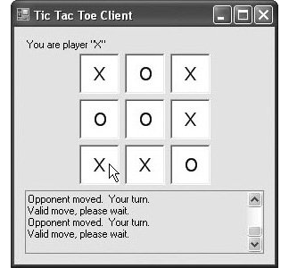
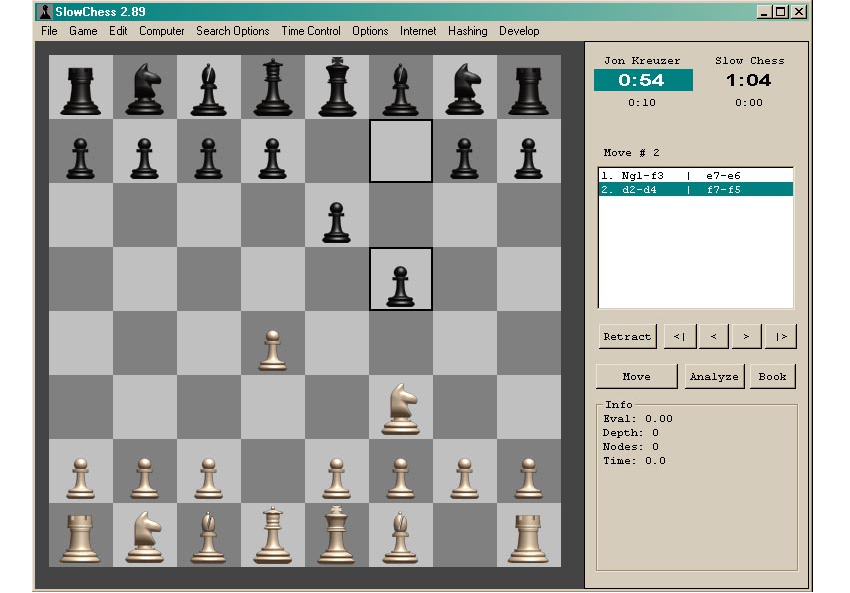
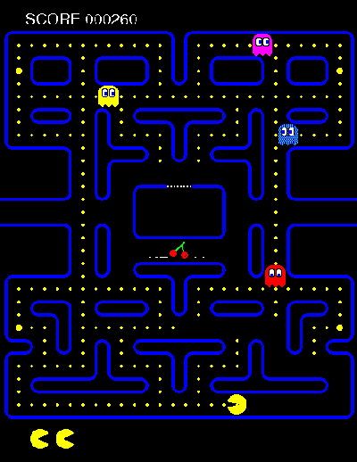

## Généralités

Tout d'abord, on va parler un peu de la différence entre
l'intelligence artificielle (IA), les neurones réseaux et apprentissage
automatique.
Beaucoup de gens ont du mal à comprendre réellement ce que l'intelligence
artificielle signifie. 

Née de différentes questions comme : 
- Les ordinateurs peuvent-ils penser ?
- Pouvons-nous les amener à comprendre les choses ?
- Pouvons-nous faire en sorte qu'un ordinateur pense et qu'il
fasse son propre truc ?

Ce sont donc un peu les questions que les scientifiques et les chercheurs se
sont posées à l'époque. Et c'est à ce moment là que le terme
**intelligence artificielle** a vu le jour. À l'époque, l'IA était simplement
un ensemble de règles prédéfinies. Donc, si tu penses qu'il y avait une
intelligence artificielle derrière les jeux tic tac toe, ou le jeux d'échecs,
alors tu as tout faux. :hand_over_mouth:

    <h6>FIGURE 01</h6>
    
    

<i>
    <ins>Figure 01</ins> : Le jeux de tic tac toe à gauche et le jeux d'échec
    à droite.
</i>

Ces jeux étaient programmés, à l'époque en utilisant
des règles prédéfinies que les humains avaient inventés et tapés dans
l'ordinateur
sous forme de code. C'étaient donc de simples programmes informatiques que
les ordinateurs
exécutaient tout simplement. Il n'y avait donc pas d'algorithmes
d'apprentissage 
automatique ou de deep learning, etc, c'était simplement du code. Donc en ce
moment, une très bonne IA était simplement un très bon ensemble de règles où
une tonne de règles différentes qui couvraient tous les cas possible que les
humains avaient mises en œuvre dans un langage de programmation, qui marchait
très bien. Ces programmes d'IA pouvaient atteindre au moins un demi-million de
lignes de codes, car ils comportaient des tonnes et des tonnes de règles
différentes. 

Donc, ce que je voudrais que tu comprennes est que si tu essais de simuler
une tâche intellectuelle dans un ordinateur, 
comme jouer à un jeu, ce qu'un humain ferait, alors cela pourrait être considéré
comme de l'IA. Pour mieux t'expliquer, on va prendre l'exemple de notre célèbre
jeux **Pacman**.

    <h6>FIGURE 02</h6>
    

<i>
    <ins>Figure 02</ins> : Le jeux de Pacman
</i>

Dans ce jeux, nous avons nos petits fantômes contrôlés par l'ordinateur et qui
se baladent un peut partout
à la recherche de notre "gas", ici Pacman qui est contrôlé par le joueur.
Tout simplement, le programme pour contrôler chaque fantôme pourrait utiliser
un simple algorithme de recherche de chemin le plus court comme par exemple
l'agorithme de *Dijkstra*. Ce dernier, n'a rien avoir avec le machine learning
encors moins le deep learning, ou... et pourtant les petits fantômes contrôlés
par cet algorithme ont toujours été considérés comme des IA. :blush:

> En théorie des graphes, l'**algorithme de Dijkstra**  permet de déterminer
le plus court chemin entre deux sommets dans un graphe connexe pondéré.

Par conséquent, on parle d'intelligence artificielle lorsque l'ordinateur
simule certains comportement humain intellectuel.

De nos jours, l'IA est devenue un domaine beaucoup plus complexe dans lequel
nous avons le machine learning (apprentissage automatique), le deep learning
(l'apprentissage profond) et le reinforcement learning (l'apprentissage par
renforcement). C'est de ces techniques nous parlerons dans ce cour.

    <h6>FIGURE 03</h6>
    

<i>
    <ins>Figure 03</ins> : Relation entre IA, apprentissage automatique
    et apprentissage profond.
</i>

Comme, tu le remarques sur la [**figure 3**](#figure-03), l'apprentissage
automatique fait partie de l'intelligence artificielle. C'est donc une des
méthodes pour écrire des programmes d'intelligence artificielle.

Maintenant, qu'est quoi **apprentissage automatique** ?

L'apprentissage automatique est l'ensemble des méthodes de programmation
permettant à un ordinateurs d'apprendre, de rechercher par lui même de façon
autonome, les rêgles à respecter pour correctement exécuter les tâches
intellectuelles en s'améliorant au fil du temps.

    

Ainsi, plutôt que de coder en dur les règles dans l'ordinateur, l'apprentissage
automatique prendre des exemples de données et les résultats issus du traitement
de ces données, pour déterminer les règles à observer à l'exécution de la tâche.
Ce sont ces règles qui sont appelés **modèle**. Cette méthode nécessite
beaucoup de données pour correctement fonctionner.

Cependant, les modèles d'apprentissage automatique n'ont pas une précision
de 100%, ce qui signifie qu'à des moments donnés, ils commettent certaines
erreurs dans l'exécution de leur tâche.

> Donc, ils n'ont pas toujours la bonne réponse à toutes
les questions ! :grin:

Donc le challenge, lorsque nous créons des modèles d'apprentissage automatique
est d'augmenter la précision aussi haut que possible. Ce qui lui permet de
faire moins d'erreurs.

Mais pour résumer cela, l'apprentissage automatique donne la capacité au
ordinateur de s'auto-programmer pour exécuter des tâches. Grâce à cette méthode
les programmeurs n'ont plus besoin de connaître toutes les règles à observer
dans l'exécution d'une tâche intellectuelle avant de créer un programme
d'intelligence artificielle.

 

    
<h3>Table des Contenus</h3>

    <ul>
    </ul>

 

 
 

[:arrow_backward: Accueil](../README.md)
| [**Installation et configuration :arrow_forward:**](../installation/README.md)

