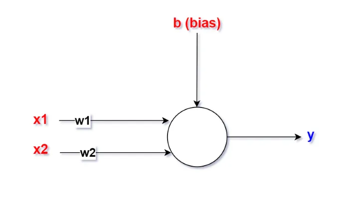
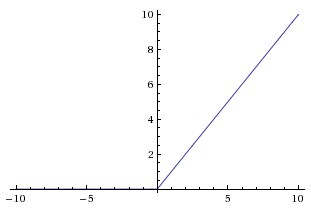
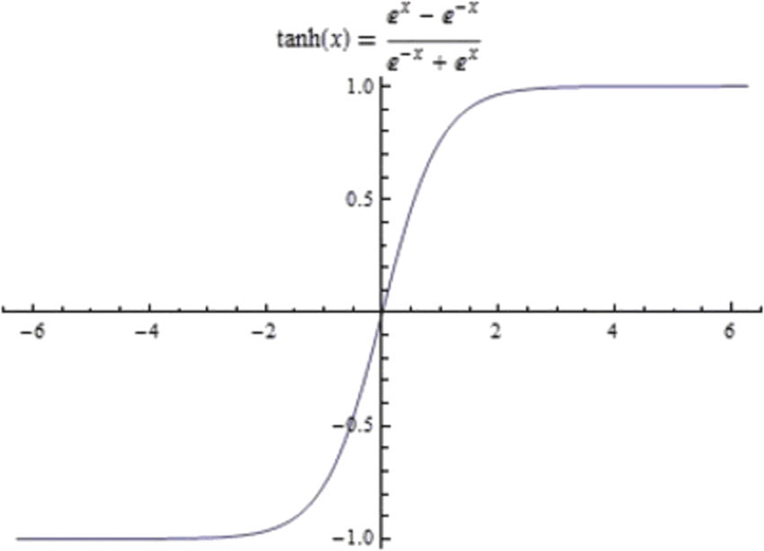

## Réseaux de neurones
Un réseau de neurones artificiels s'inspire du fonctionnement de celui du cerveau humain et prend corps dans un ordinateur. Au sein du réseau, les neurones sont structurés par couches. Il n'y a pas de connexion entre les neurones d'une même couche. Donc, les connexions ne se font qu'avec les neurones de la couche suivante (voir figure ci-dessous). Généralement, chaque neurone d'une couche $h_{i}$ est lié avec tous les neurones de la couche en aval $h_{i+1}$ (couche suivante) et celle-ci uniquement, par ce qu'on appelle un poid (un nombre). On appelle couche d'entrée $i$, l’ensemble des neurones d'entrée et couche de sortie $o$, l’ensemble des neurones de sortie. Les couches intermédiaires $h_{1}, h_{2}, ..., h_{n}$ n'ont pas de contact avec l'extérieur et sont donc nommées `couches cachées` (hidden layers). Chaque neurone est une unité de calcul autonome et indépendante des autres neurones. Dans les cas les plus courants, chaque couche a un **biais** qu'on note généralement `b` et qui est aussi un nombre.  

Les neurones de la couche d'entrée (couche $i$) reçoivent les informations censées expliquer le phénomène ou le problème à analyser. Si l’on prend comme exemple la détection préventive des entreprises en difficulté, il s'agit le plus généralement de ratios financiers. Le neurone de sortie (couche $o$) prendra la valeur `0` ou `1` selon la santé de l'entreprise : saine ou en défaillance.  

Essayons de voir ce qui se passe au niveau d'un neurone. Considérons donc le schéma suivant:

Oui, je sais, ce n'est pas très jolie, mais ne fait pas attention ! Ainsi, pour calculer la sortie
`y` d'un neurone, on pose la formule suivante:

$$
y = \sum_{i=1}^{n}{w_{i}x_{i}} + b
$$

Avec:
- $w_{i}$ les poids de chaque connexion du neurone.
- $x_{i}$ les valeurs des variables qui caractérisent chaque données de la dataset, si ce neurone se trouve sur la couche d'entrée. Sinon, $x_{i}$ représentera les valeurs de toutes les sorties des neurones de la couche précédent celle de ce neurone.
- $b$ le biais de la couche auquelle appartient ce neurone.
- $n$ le nombre de variables qui est encore le nombre d'entrée du neurone. Dans ce cas si $n = 2$
- $y$ la sortie de ce neurone.
- Le symbole mathématique $\sum{}$ (grand sigma) représente la somme.

### Fonction d'activation
Les fonctions d'activation sont simplement des fonctions qui sont appliquées à la somme des poids d'un neurone. Elles peuvent être ce que l'on veut. Mais ce sont généralement des fonctions d'ordre/degré supérieur qui visent à ajouter une dimension supérieure à nos données.  

Soit $F$ une fonction d'activation. Cette dernière est appliqué comme ci-dessous:

$$
y = F(\sum_{i=1}^{n}{w_{i}x_{i}} + b)
$$

Utiliser une fonction d'activation nous permet d'introduire plus de complexité dans notre modèle.
En transportant nos données dans une dimension supérieure, on arrive généralement à faire de meilleures prédictions plus complexes.  

#### Fonction ReLU

Cette fonction s'appelle **ReLU** (Rectified Linear Unit). Elle prend toutes les valeurs qui sont inférieures à zéro et les rend nulles. Donc toutes les valeurs de `x` qui sont, tu sais, dans le *négatif*, ça rend juste leur `y` nul. Et toutes les valeurs positives sont égales à eux mêmes. Donc si `x = 10`, alors `y = 10`.

$$
F(x) = ReLU(x) = max(0, x)
$$

Le maximum entre `0` et un nombre négatif est `0` et le maximum entre `0` et un nombre positif
est nombre positif. Cela nous permet d'éliminer tous les nombres négatifs, n'est-ce pas ?

#### Fonction Tangante hyperbolique

Cela écrase en fait nos valeurs entre `-1` et `1`. Donc ça prend n'importe quelle valeur. Plus les valeurs sont positives, plus elles sont proches de `1`, plus elles sont négatives, plus elles sont proches de `-1`.

$$
F(x) = tanh(x) = \frac{e^x - e^{-x}}{e^x + e^{-x}}
$$

 
 

[<--](../core_learning_algorithms/README.md) Je reviens à la session **précédente**: [Algorithmes d'apprentissage fondamentaux -->](../core_learning_algorithms/README.md)
