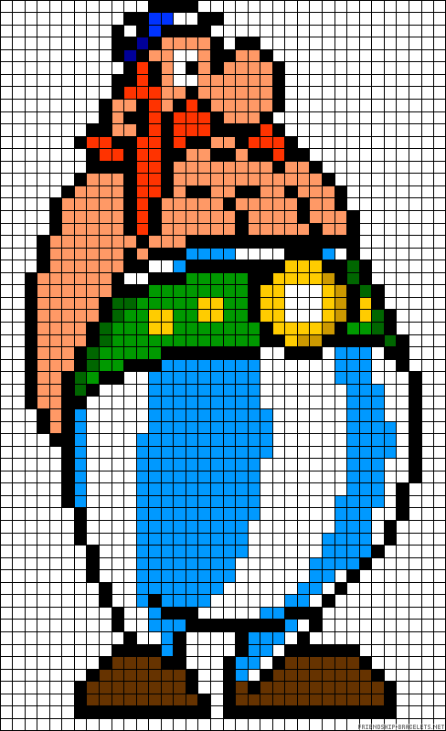
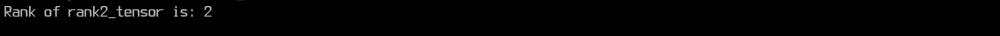
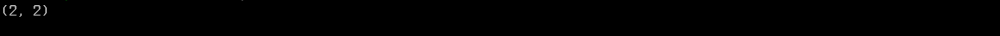
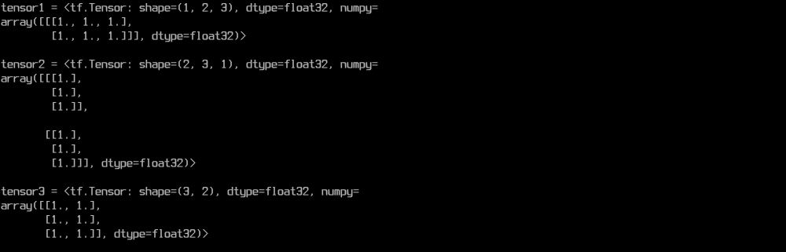
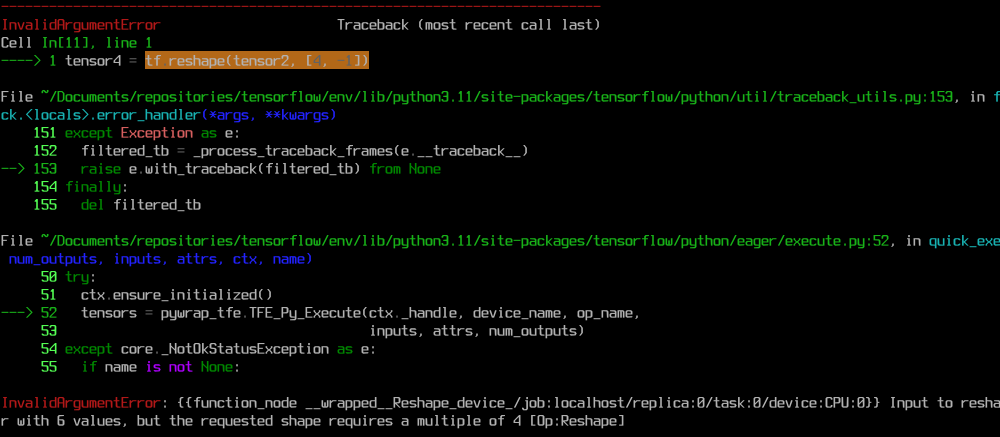

## Les tenseurs


Voyons un peu ce que s'est qu'un tenseur. Je sais que cela semble être un nom
compliqué. En anglais, le mot "tenseur" signifie "Tensor". Je sais que tu
t'imagine déjà d'où vient le nom TensorFlow (flux de tenseurs) !
Si tu as déjà fait de l'algèbre
linéaire, ou même du calcul vectoriel de base, tu devrais savoir ce que c'est.

Un tenseur est une généralisation des vecteurs et des matrices à des dimensions
potentiellement plus élevées. En interne, `TensorFlow` représente les tenseurs
comme des tableaux à **n-dimensions** contenant des données de type de base
(`int`, `float`, `str`, etc.).

En machine learning, on utilise souvent un vecteur pour représenter un point
de donnée. Car les points de données on souvent plusieurs caractéristiques,
c'est à dire : une liste de nombres par exemple qui représentent les
différentes observations qui ont été faites sur ces données. Étant donné que
lorsqu'il s'agit d'effectuer de très grands calculs sur des données,
les listes basiques ne font pas le poids contre les tableaux numériques comme
**les tableau Numpy** et les **tenseurs**, alors on utilise les
tenseurs lorsqu'on se trouve sur TensorFlow ou autres frameworks de
machine learning, pour traiter des données numériques beaucoup plus rapidement
et efficacement.

> Mais, comment je peux représenter une image, ou une vidéo sous
forme de tenseur ? :thinking:

Pour représenter une image sous forme de tenseur, c'est simple ! Tout d'abord
un pixel a trois composants, Red, Green et Bleu (RGB), ce qui signifie qu'un
pixel est un vecteur (tableau à **1-dimension**) de 3 nombres entiers qui
prennent chacun une valeur entre 0 et 255. Une image, quant à elle, est une
matrice de pixel, c'est à dire un tableau de pixels à **2-dimensions**. Donc,
si on souhaite représenter une image sous forme tenseur, on le représentera un
tenseur à 1 + 2 = **3-dimensions** où
- le nombre de lignes correspondra à la hauteur de l'image,
- le nombre de colonnes conrespondra à la largeur de l'image,
- et le nombre de profondeur sera égal à 3, car un pixel à trois valeurs (RGB).


<div align="center">
    <h6>FIGURE 01</h6>
    
</div>
<p align="center">
<i>
    <ins>Figure 01</ins> : Une image est représentée pixel par pixel.
</i>
</p>

Je te laisse imaginer comment on peut représenter une vidéo sous forme tenseur,
en sachant qu'une vidéo est composée d'un grand nombre de frames qui ne sont
qu'en réalités des images.

Ne sois pas surpris que les tenseurs soient un aspect fondamental de TensorFlow.
Ils sont au coeur de TensorFlow, ils représentent, la plus part du temps,
les principaux objets avec lesquels nous allons travailler.
Les programmes écris sous TensorFlow fonctionnent en construisant un
graphe d'objets `Tensor` qui définit les différentes liaisons entre les
tenseurs. L'exécution de différentes parties du graphe permet de générer des
résultats.

Chaque tenseur a un type de données et une dimension (`shape`).
- Le type donnée est simplement le type d'informations stockées dans le 
tenseur. Il peut être: `float32`, `int32`, `string` et autres types. Il est
très rare de rencontrer des tenseurs gérer des types de données autres que des
nombres.
- `shape` représente les dimensions du contenu du tenseur.

<br/>
<details id="table-content" open>
    <summary><h3>Table des Contenus</h3></summary>
    <ul>
        <li><a href="#récupération-des-données">Création d'un tenseur</a></li>
        <li><a href="#récupération-des-données">Rang/degré d'un tenseur</a></li>
        <li><a href="#dimensions-des-tenseurs">Dimensions des tenseurs</a></li>
        <li><a href="">Redimensionnement d'un tenseur</a></li>
        <li><a href="">Types de tenseurs</a></li>
        <!-- <li><a href="">Evaluation des tenseurs</a></li> -->
    </ul>
</details>
<br/>

### Création d'un tenseur
Pour créer un tenseur, on utilise la classe `tf.Variable` qui prend en premier
argument la donnée à stocker et en second argument, le type cette donnée.
Vous trouverez ci-dessous un exemple de création de différents tenseurs.

###### `</> python {code:01:01}`
```python
import tensorflow as tf  # N'oublit pas d'importer la librairie.


# On définit un tenseur qui stocke une chaine de caractères.
string = tf.Variable("This is a string", tf.string)

# On définit un tenseur qui stocke un nombre entier
# représenté sous 16 bits.
number = tf.Variable(324, tf.int16)

# On définit un tenseur qui stocke un nombre réel
# représenté en virgule flottante à double précision.
floating = tf.Variable(3.567, tf.float64)

```

Les tenseurs que nous venons de définir dans le code python ci-dessus, sont
appelés des scalaires. Un scalaire est tout simplement une valeur de type bien
défini. On parle de vecteur de valeurs, lorsqu'on a plus d'une valeur. Donc
une matrice sera considérée comme un vecteur de vecteurs. Et ainsi de suite !


### Rang/degré d'un tenseur
Un autre mot pour désigner le rang est le **degré**. Ces termes désignent
simplement le nombre de dimensions du tenseur. Ce que nous avons créé dans la
section précédente sont des tenseurs de rang `0`, et comme je te l'avais, ils
sont appelés **scalaire**.

Maintenant, lorsqu'il s'agit d'un tableau ou d'une liste, on a immédiatement
au moins le rang `1`.

###### `</> python {code:02:01}`
```python
# ici, je crée un tenseur de rang 1:
rank1_tensor = tf.Variable(['Test', 'ok'], tf.string)
# ici, je crée un tenseur de rang 2:
rank2_tensor = tf.Variable([['Test', 'ok'], ['test', 'yes']], tf.string)

```

La raison pour laquelle `rank2_tensor` est un tenseur de rang `2` est que nous
l'avons initialisé avec des listes à l'intérieur d'une autre liste, ce qui a
créé simplement un vecteur de vecteurs. C'est cela qu'on appelle **matrice**.
Une matrice est dont un tenseur de rang 2, c'est à dire tenseur à
**2-dimension**.

Pour déterminer le rang d'un tenseur, tu peux appeller la méthod `tf.rank()`
comme suit :

###### `</> python {code:02:02}`
```python
rank = tf.rank(rank2_tensor)
print(f"Rank of rank2_tensor is: {rank}")

```


Nous avons assez parlé du rang des tenseurs, il est temps de parler
de leur forme.


### Dimensions des tenseurs
La forme ou les dimensions d'un tenseur sont simplement le nombre d'éléments
qui se trouve
dans chaque dimension. TensorFlow essaiera de déterminer les dimensions d'un
tenseur mais parfois elles peuvent être inconnues.

Pour obtenir les dimensions d'un tenseur, on utilise l'attribut `shape`.

###### `</> python {code:03:01}`
```python
print(rank2_tensor.shape)
# Affiche un tuple d'entiers qui représente
# la forme du tenseur `rank2_tensor`.

```


Il s'agit ici d'un attribut très important pour le développement des algorithmes
de machine learning. Car, lorsqu'on se trompe de dimension pendant les calculs,
le programme nous retourne des bugs, donc ne fonctionne plus.

À la création d'un tenseur, par exemple si on a plusieurs lignes de données,
toute les lignes doivent **avoir obligatoirement le même nombre d'éléments**.
Donc, si tu veux créer une matrice de nombres réels de dimension $3 \times 5$
(3 lignes, 5 colonnes), alors toutes les 3 lignes **doivent obligatoirement
contenir 5 nombres réels** chacune. Pas plus ni moins.


### Redimensionnement d'un tenseur
Maintenant, il existe des moyens pour redimensionner ou changer la forme
d'un tenseur sans modifier ses valeurs.

Le nombre d'éléments d'un tenseur est le produit des valeurs $x_1, x_2, \ldots, 
x_i, \ldots, x_n$, de toutes ses dimensions `(x1, x2, ..., xi, ..., xn)`.
Étant donnée que deux tenseurs de dimensions différentes peuvent contenir le
même nombre d'éléments, alors il est possible de changer les dimensions d'un
tenseur. Ce pendant, lorsqu'on modifie les dimensions d'un tenseur, cela
affecte son rang.

L'exemple ci-dessous montre comment changer les dimensions d'un tenseur.

###### `</> python {code:04:01}`
```python
tensor1 = tf.ones([1, 2, 3])  # Crée un tenseur de dimensions (1, 2, 3) remplit de 1.
tensor2 = tf.reshape(tensor1, [2, 3, 1])  # Redimensionne le tenseur existant en (2, 3, 1).

tensor3 = tf.reshape(tensor2, [3, -1])  
# -1 indique au tenseur de calculer 
# la taille de la dimension restante à cet endroit. 
# Ce qui donnera au tenseur la forme [3, 3].

# Le nombre d'éléments dans le tenseur redimensionné DOIT correspondre 
# au nombre d'éléments dans le tenseur d'origine.

```

Maintenant, jetons un coup d'oeil à nos différents tenseurs.

###### `</> python {code:04:02}`
```python
print(f"{tensor1 = }\n")
print(f"{tensor2 = }\n")
print(f"{tensor3 = }\n")

# Remarque les changements de dimension.

```


Lorsqu'on place `-1` au niveau d'une des dimensions, la fonction de
redimensionnement se base sur le nombre d'éléments restant afin
de définir la valeur de cette dimension. C'est donc ce qui s'est passé pour
avoir le `tenseur3`. Étant donné qu'il y avait au total
$2 \times 3 \times 1 = 6$ éléments, alors lorsque le nombre de lignes a été
définis à 3, `reshape()` a simplement effectué l'opération $6 \div 3 = 2$ pour
connaitre le nombre d'éléments à placer sur chaque ligne pour obtenir le même
nombre d'éléments sur les 3 lignes.

Donc, pour te dire de faire attention lorsque tu veux fixer les paramètres de
redimensionnement, car si, par exemple on avait pris 4 comme nombre de lignes
et ensuite placé -1 comme nombre de colonne, il y aurait eu un problème et
la fonction `reshape()` allait nous balancer une belle erreur de type 
`InvalidArgumentError` en pleine face. :laughing:

<div align="center">
    <h6>FIGURE 02</h6>
    
</div>
<p align="center">
<i>
    <ins>Figure 02</ins> : Écran d'erreur qu'on obtient lorsqu'on essaie de
    redimensionner tensor2 qui contient <strong>6</strong> éléments avec le paramètre de
    redimensionnement <strong>(4, -1)</strong>.
</i>
</p>

> Ah, informe moi. :nerd_face:

Au fait, si tu regardes le nombre d'éléments total qui est 6, il n'est pas
divisible par 4, car $6 \div 4$ ne donne pas un nombre entier. Or pour avoir
un nombre d'éléments répartis de façon équitable sur toutes les 4 lignes, il
va faloir trouver 2 éléments de plus à ajouter au 6 éléments de départ.
Ce qui n'est pas possible à trouver, étant donné que le nombre d'éléments dans
un tenseur est fixe.

C'est tout ce qu'il faut savoir à propos de cette fonctionnalité. Il faut
savoir qu'elle fait partie de l'une des fonctionnalités les plus utilisées
en machine learning. On l'utilisera donc au fur et à mesure qu'on avancera dans
ce cour.


### Types de tenseurs
Il existe différents types de tenseurs que nous pouvons utiliser. Jusqu'à
présent, le seul qu'on a vu est `tf.Variable`.
Avant d'aller loin, je te présente rapidement les autres types de tenseur
les plus couramment utilisés en TensorFlow.

- `tf.Variable`;
- `tf.Constant`;
- `tf.Placeholder`;
- `tf.SparseTensor`.

À l'exception de `tf.Variable`, tous ces tenseurs sont immuables, ce qui 
signifie qi'après leurs créations, on ne peut plus modifier les valeurs des
éléments qu'ils contiennent pendant l'exécution.
On utilise en général un tenseur de type `Variable` lorsque, au cour de
l'exécution du programme, on prévoit changer les valeurs des éléments qu'il
contient.

On parlera beaucoup plus en profondeur de chacun d'eux au fur et à
mesure de leur utilisation.

<!--
### Evaluation des tenseurs
Parfois, on a besoin d'évaluer un tenseur. En d'autres termes, récupérer sa
valeur. Pour cela, on utilise une session. Une session permet d'exécuter des
graphes ou des parties de graphes. Il alloue des ressources (sur une ou
plusieurs machines) pour effectuer cela. Et comme un tenseur peut être
considéré comme une partie de graphe, c'est pour cela qu'on utilise une session
pour l'évaluer.

> Euh, tu peux me rappeler un peut ce que s'est qu'un graphe ? :thinking:

Bien sûr que oui ! Au fait, Un graphe définit le calcul. Il ne calcule rien,
(donc ne sert pas à évaluer un tenseur), il ne contient aucune valeur,
il définit tout simplement les opérations spécifiées dans le code. On parle
souvent de graphe de calcul.

###### `</> python {code:06:01}`
```python
# On crée la session en utilisant le graphe par défaut:
with tf.compat.v1.Session() as sess: 
    tensor1.eval()

```
Il existe de nombreuses manières différentes d'y parvenir. Mais je vais noter
ci-dessous la manière la plus simple.

Mais, tu peux simplement utiliser la fonction `tf.print()` pour évaluer un
tenseur.

###### `</> python {code:06:02}`
```python
tf.print(tensor1)

```

> Et pourquoi s'embêter à utiliser une session, alors qu'on pouvait tout
simplement utiliser la fonction `tf.print()` ? :raised_eyebrow:

Dans le code ci-dessus, nous avons évalué la variable tensorielle qui était
stockée dans le *graphe par défaut*. Le graphe par défaut contient toutes
les opérations qui ne sont pas spécifiées dans un autre graphe. Il est possible
de créer nos propres graphes séparés. Mais pour l'instant, nous allons nous
en tenir au graphe par défaut.

-->


<br/>
<br/>
<div align="center">

[:arrow_backward: Installation et configuration](../installation/README.md)
| [**Algorithmes d'apprentissage fondamentaux :arrow_forward:**](../core_learning_algorithms/README.md)

</div>
